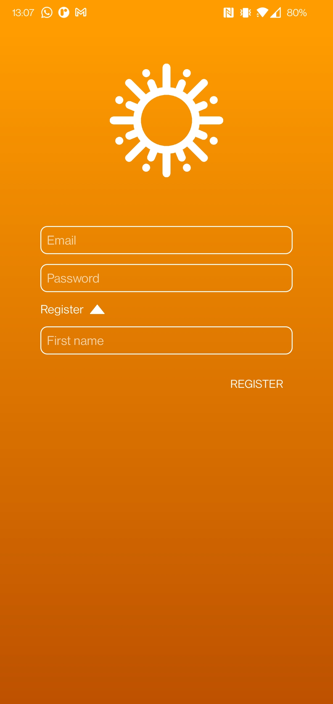
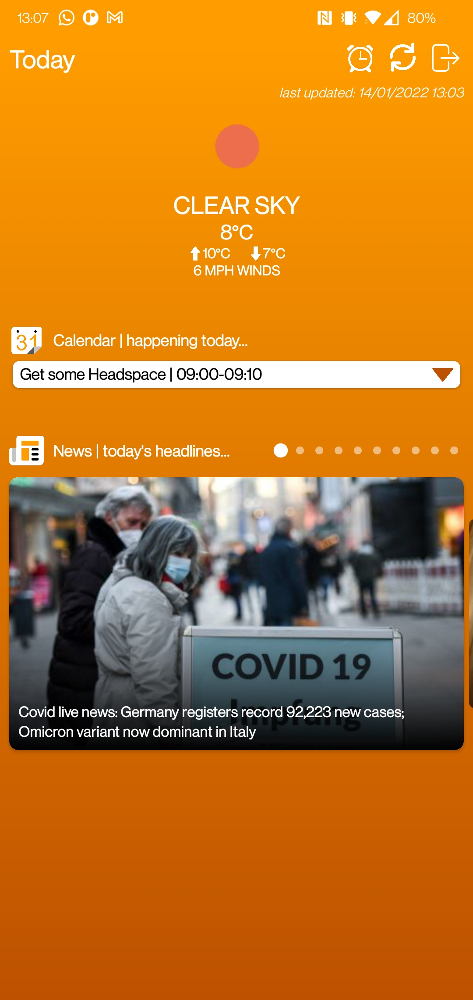
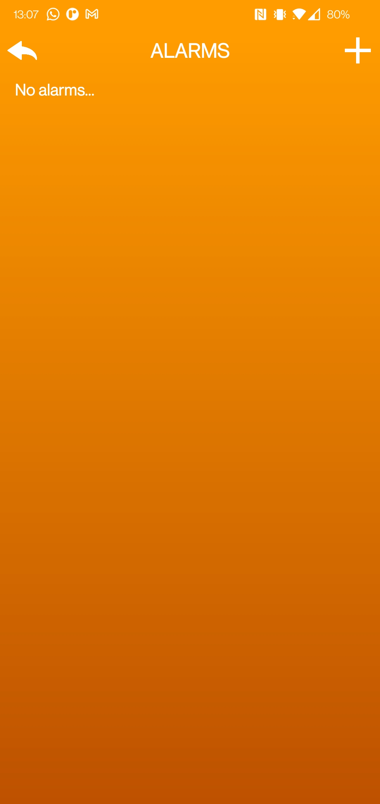
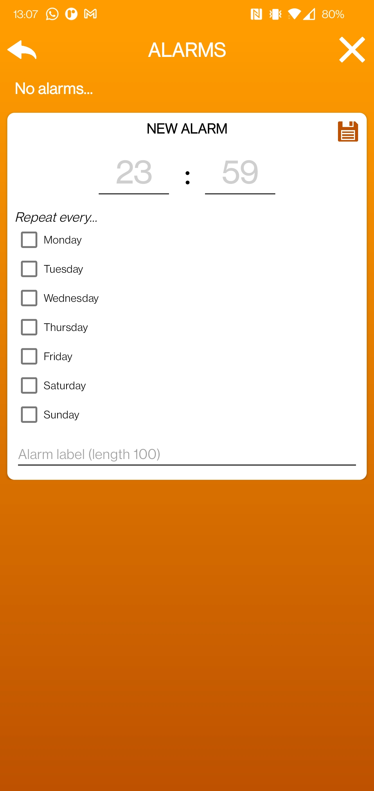
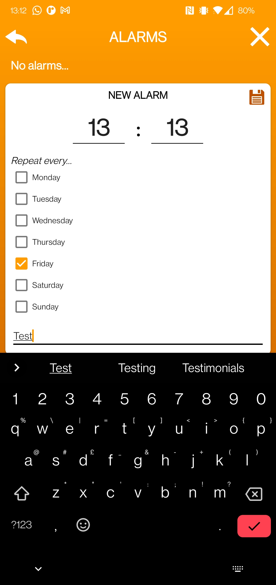
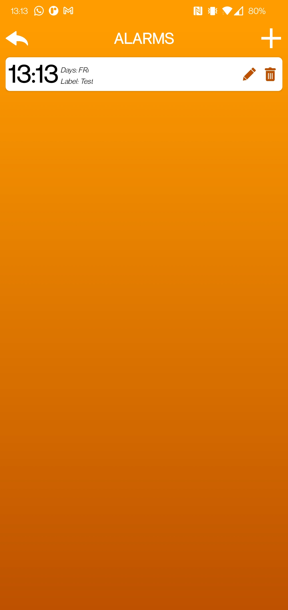
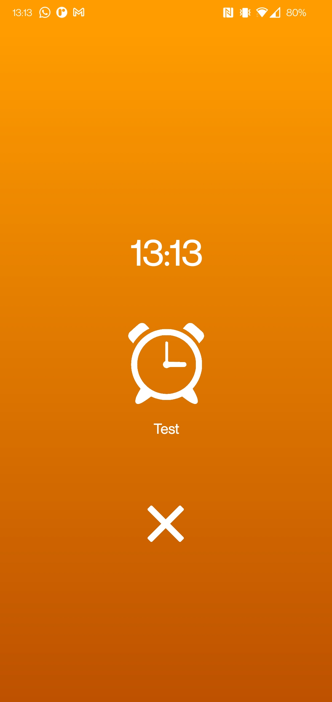

# Today - an Android app
Today is an Android app that presents information to you which you may wish to know when starting your day. Information such as today's weather, calendar entries (from your Google Calendar), and news headlines.

The app also acts as an alarm. The idea of having an integrated alarm is that it becomes faster for users to access the information they need to before starting their day, as soon as they wake up. The reason the process is faster is because access to the aforementioned information is seamless; when the alarm has been dismissed by the user, they are taken straight to the home screen that lists all said information.

## Screenshots

Login/Register Page | Login/Register Page
--- | ---
 | 
Home Page | Alarms Page (empty)
 | 
Alarm Page (with alarm creation form) | Alarms Page (with completed form)
 | 
Alarm Page (with new alarm entry) | Alarm Ringing Page
 | 
